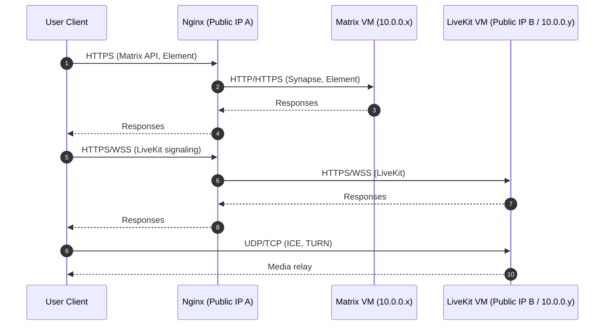

# Network Flow

Notes:
- Media traffic prefers direct UDP to LiveKit/turn.
- Nginx handles TLS termination and routes internal traffic.
- Temporary public IPs should be updated in DNS when they change.
