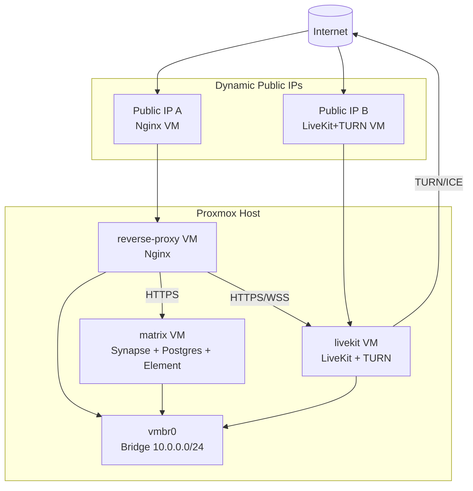

# Architecture Overview

Notes:
- Public IPs are temporary and may change.
- Synapse, Postgres, and Element are co-located in the Matrix VM.
- No LiveKit recordings; only message logs are retained.
