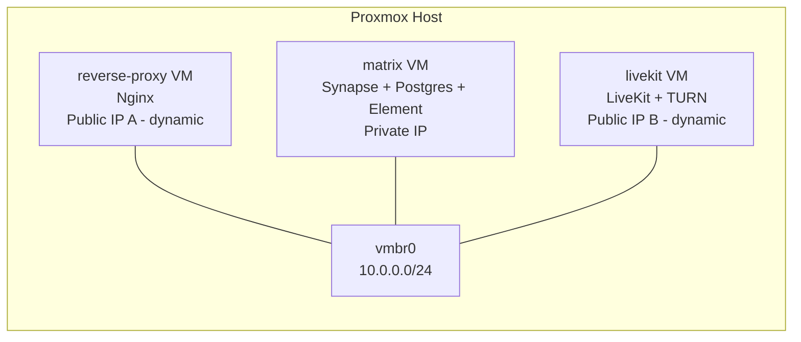

# VM Layout

Notes:
- Keep Nginx and LiveKit on public IPs for reliability.
- Matrix VM remains private; traffic enters via Nginx.
- Message logs live in the Matrix VM; no recording storage is provisioned.
